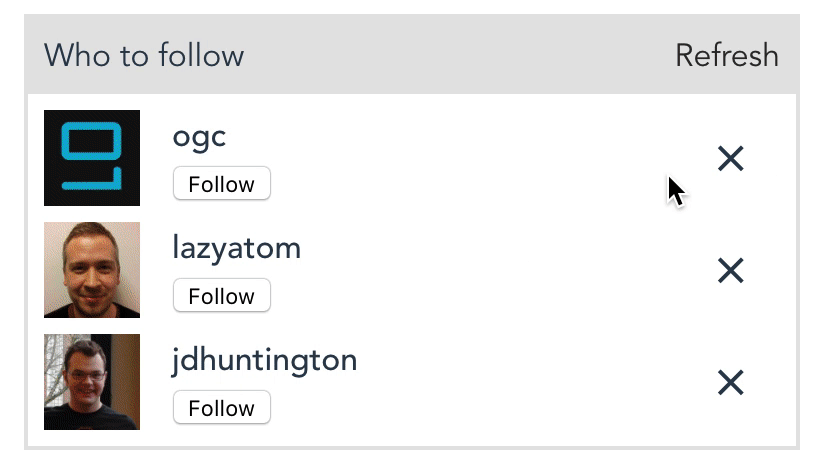

# github-suggested-people

Sample component displaying twitter-like follow suggestions.

Implemented using [standard Vue.js approach](src/components/suggested-people.vue) and [RxJS alternative](src/components/suggested-people-rx.vue) inspired by [The introduction to Reactive Programming you've been missing](https://gist.github.com/staltz/868e7e9bc2a7b8c1f754).



```
npm install
npm run serve
```

##### RxJS implementation 
The implementation is limited to fixed per fetch count, I couldn't figure out display the tile as loading properly too, help is welcome :).

Despite the renown of Rx programming, I find it much harder to reason about than the _standard_ alternative - I can imagine the Observables being good solution to certain problems though. 
